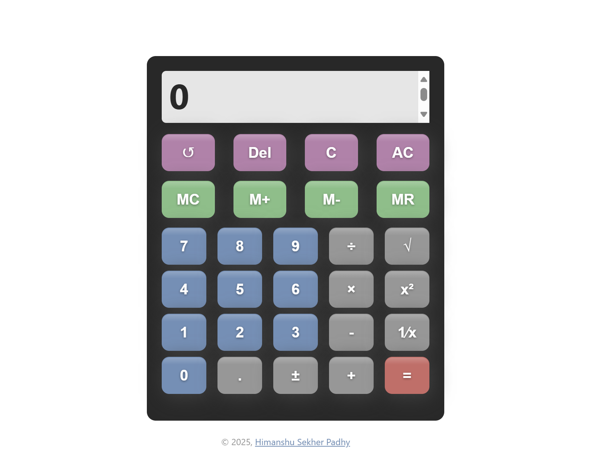

# 🧮 React based Calculator App

Welcome to the **React based Calculator** — a beautifully crafted, fully responsive, modern calculator built with 🔥 **ReactJS** and ❤️ **custom CSS**. This project was designed with a focus on **mobile-first UI/UX**, **3D button interaction**, and **smooth, tactile animations** for a real-world button feel.

---

## 📸 Preview



## 📱 Features

✨ Sleek, minimalist interface with vibrant color theory 
🎨 Stunning 3D buttons with realistic press animation  
📏 Responsive layout — fits all screen sizes (especially below 360px)  
⚡ Instant evaluation with clean UI separation  

---

## 🧰 Tech Stack

| Technology  | Description             |
|-------------|-------------------------|
| `ReactJS`   | Frontend logic & state management |
| `CSS3`      | Animations, responsive layout, and styling |
| `Bootstrap` | Grid utility for quick layout alignment |
| `Flexbox`   | Button arrangement within rows |

---

## 🗂️ Project Structure

```bash
📦 react-calculator/
│
├── 📁 node_modules/                 # Project dependencies
├── 📁 public/
│   ├── 📷 calculator.png           # Fav icon image
│   ├── 📄 index.html               # HTML entry point
│   ├── 📷 logo192.png              # PWA branding
│   ├── 📷 logo512.png              # PWA branding
│   ├── 📄 manifest.json            # Web app manifest
│   └── 📄 robots.txt               # SEO robot settings
│
├── 📁 src/
│   ├── 📁 assets/
│   │   ├── 📁 images/
│   │   │   └── 🖼️ dummy.png       # Goal image
|   │   │   └── 🖼️ preview.png     # Preview image
│   │   ├── 📁 styles/
│   │   │   ├── 🎨 App.css         # Global styles
│   │   │   └── 🎨 AppView.css     # App view-specific styles
│   │   └── ⚛️ react.svg           # React logo asset
│   │
│   ├── 📁 components/
│   │   └── 🔘 Button.js           # Reusable button component
│   │
│   ├── 📁 views/
│   │   └── 📄 AppView.js          # Main UI layout structure
│   │
│   ├── 📄 App.js                  # Root app component
│   ├── 📄 App.test.js             # Sample test file
│   ├── 📄 index.js                # ReactDOM renderer
│   ├── 📄 index.css               # Entry-level CSS overrides
│   ├── ⚛️ main.jsx                # Entry point for JSX
│   ├── 📄 serviceWorker.js        # Optional PWA support
│   └── 📄 setupTests.js           # Test environment setup
│
├── 📄 .gitignore                  # Git ignored files
├── 📄 package.json                # Project metadata & scripts
├── 📄 package-lock.json           # Dependency lockfile
└── 📄 README.md                   # You're reading it!
